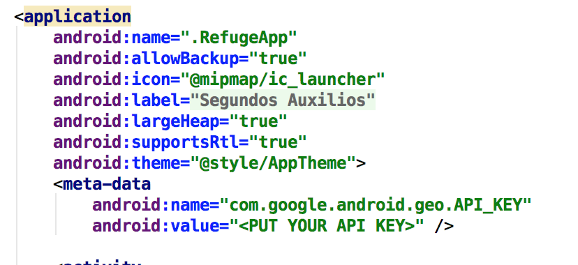
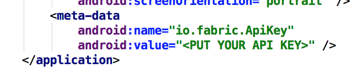

# Koru

Koru is an open source project that connects needs of people affected after a disaster with people looking to send help, in a way that informed actions can be taken and help can be better distributed.

Koru assists during the humanitarian aid and reconstruction stage after a disaster, with the objective to accelerate and organize the recovery of affected areas by quickly gathering and processing the needs of affected communities.

## Explore the project ##

This branch host the Android app. For this project we follow the MVP + Clean Architecture letting us segregate it in different layers.

### Prerequisites ###

* Android Studio 2.3.3 or newer.
* Android SDK.
* Fabric Account (you will need your api key and secret key)
* Google Maps Api Key

### Features ###

* MVP and Clean Architecture
* Realm
* Android Permissions
* Google Maps and Places
* Retrofit
* Crashlytics

### Implementing the app ### 

After you clone the app to make your first build, you will have to replace yours Api Keys and Secret Key for Google Maps and Crashlytics.

 
