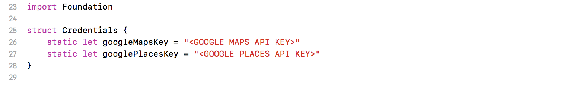
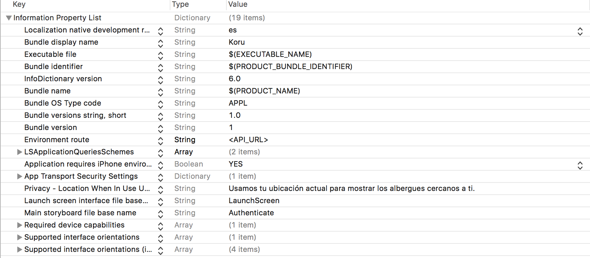
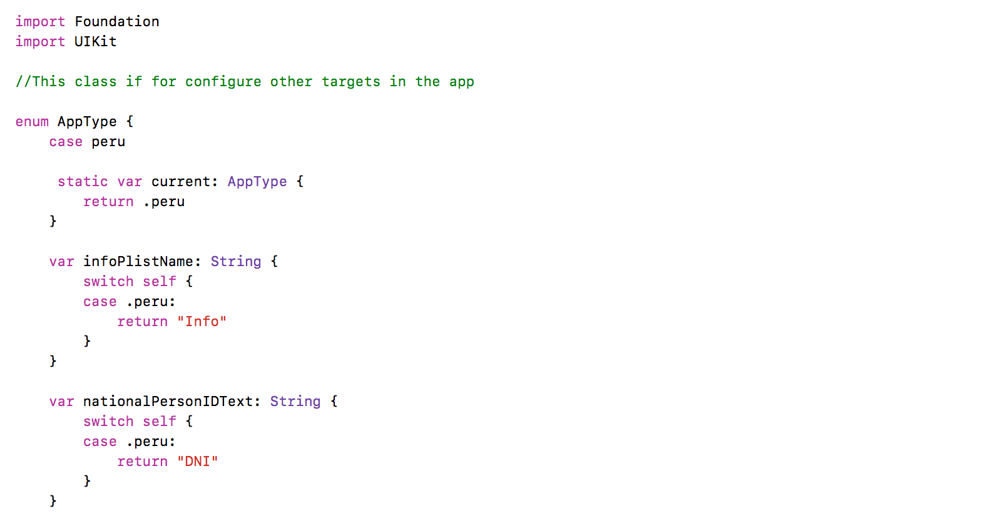

# Koru

Koru is an open source project that connects needs of people affected after a disaster with people looking to send help, in a way that informed actions can be taken and help can be better distributed.

Koru assists during the humanitarian aid and reconstruction stage after a disaster, with the objective to accelerate and organize the recovery of affected areas by quickly gathering and processing the needs of affected communities.

## In the Project ##

This branch has the IOS APP. In this project we use MVVM Arquitecture and Moya for call diference services.

### Prerequisites ###

* XCODE 9 or more
* Google Maps API KEY
* Google Places Key
* Install pods

### characteristics ###

* MVVM
* Moya
* Moya Mapper
* Core Data
* Google Maps ans Places

### Configuration in the App ###

* Configuration Google API KEY

After you clone, you will have to configure in Credentials.swift your Google Maps and Google places API Keys

 

* Configure API for the services

For configure you API, you will have replace in the info.plist, Environment route.

 

* Different targets in the App

In the class AppType, you can configure different targets in the app and changes some option.

 

